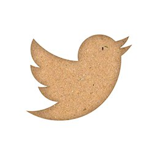

# Cardbird

> A Google Cardboard Twitter client with infinite scrolling.

Created during HackSC 2015. [Devpost](http://devpost.com/software/cardbird)

This web app displays the latest tweets from the user's home timeline in 3D. By turning right, the user can see more tweets. Tweets outside of the user's field of view get replaced by new tweets in the user's feed, allowing tweets to be displayed continuously. Media associated with the tweet can be viewed directly underneath the tweet.

Cardbird runs entirely in your browser. It utilizes [Chrome Experiments for VR](https://vr.chromeexperiments.com/) for setting up three.js to work with Cardboard. OAuth.io is used to authenticate the user with Twitter easily and to call the Twitter API. Tweets are converted into three.js objects and are inserted and removed from the scene as the user turns left and right.

### What's next

Currently, Tweets are read-only, but the retweet/favorite buttons could be used to perform their associated actions. If a tweet is part of a conversation, the other tweets in that conversation could also be displayed behind the tweet.
